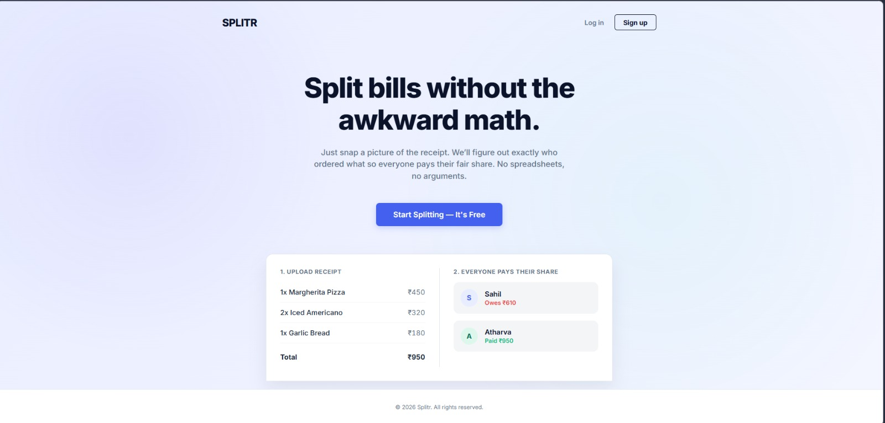
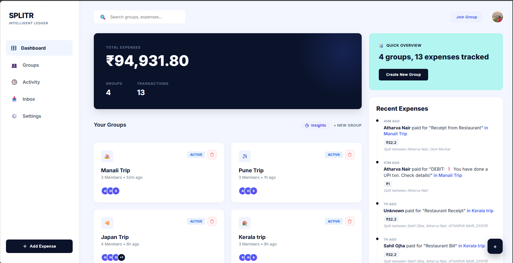
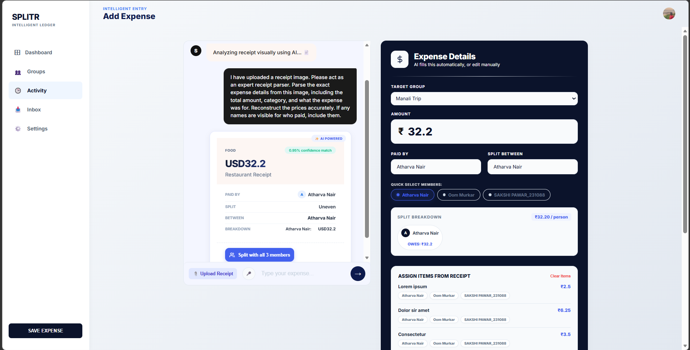
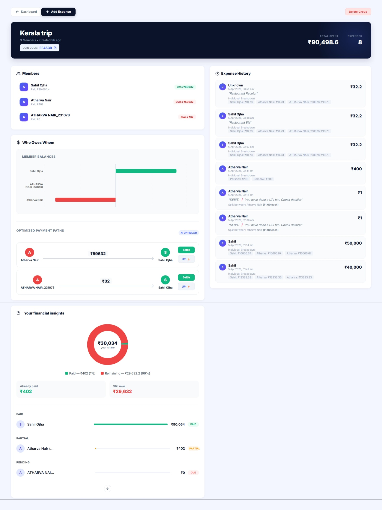
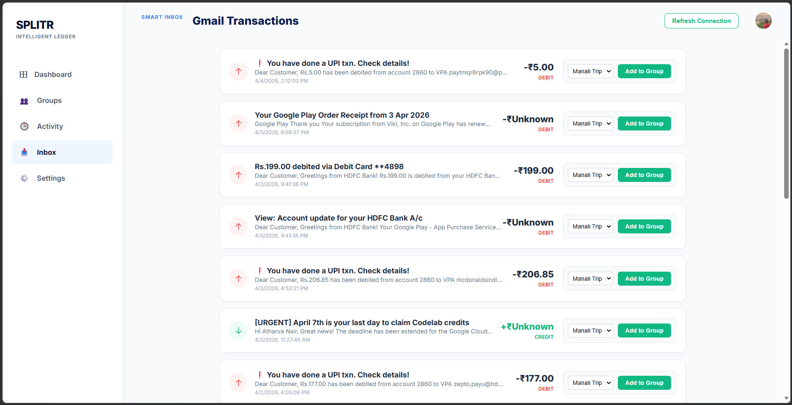

#  Splitr

### *Split smarter. Settle faster. Stress less.*

<div align="center">
  
</div>

---

##  Overview

Managing group expenses is messy. Whether it's a trip with friends, a shared apartment, or a team lunch — tracking who paid what, and who owes whom, quickly turns into a tangled web of IOUs, awkward reminders, and unnecessary back-and-forth transactions.

**Splitr** is a smart expense-splitting platform that cuts through the chaos. It minimizes the number of transactions needed to fully settle all debts within a group, and layers on AI-powered insights, natural language expense input, and predictive suggestions — so everyone can focus on the experience, not the math.

---

##  Key Features

-  **Minimum Transaction Optimization** — Core algorithm that computes the least number of transactions required to settle all group balances. No more redundant payments.
-  **AI Expense Chatbot** — Add expenses or query group balances using plain English. (e.g., *"Add ₹500 for dinner split between Raj, Priya, and me"*)
-  **Predictive Settlement Suggestions** — AI-driven prompts that suggest the best time and amount to settle, based on group activity.
-  **Real-Time Collaboration** — All group members see updates instantly. No refresh needed.
-  **Flexible Expense Input** — Add expenses manually through forms or naturally through the chatbot interface.
-  **Clear Dashboard Summary** — A clean overview of what you owe, what you're owed, and the group's current balance state.
-  **Optimized Settlement Plan** — A step-by-step, ready-to-execute payment plan generated automatically for your group.
-  **UPI/Razorpay Gateway Integration** — Initiate settlements directly via UPI without leaving the app.

---

##  How It Works

```
Landing Page
    ↓
Authentication (Sign Up / Log In)
    ↓
Create a New Group  ──or──  Join an Existing Group
    ↓
Group Dashboard (View balances, members, activity)
    ↓
Add an Expense (Manual form or AI Chatbot)
    ↓
Settlement Plan Generated (Minimum transactions calculated)
    ↓
Settle Up 
```

---

##  Tech Stack

| Layer          | Technology            |
|----------------|-----------------------|
| **Frontend**   | `React.js` |
| **Backend**    | `Node.js / Express` |
| **Database**   | `MongoDB Atlas` |
| **AI / NLP**   | `OpenRouter API` |
| **Auth**       | `JWT` |
| **Payments**   | `UPI Integration along with Razorpay Gateway` |

---

##  Screens & Pages

> A walkthrough of Splitr's core screens — each designed for clarity, speed, and a seamless user experience.

---

### 01 · Group Dashboard &nbsp;
> *Your financial command center for any group.*

The central hub — see total group spend, individual balances, recent activity, and a quick summary of what you owe or are owed. Everything at a glance.

<div align="center">
  
  <!--  Replace with your actual screenshot -->
</div>

---

### 02 · Add Expense &nbsp;
> *Manual form or just type it — your choice.*

Add expenses in seconds. Use the structured form with category tags, or let the AI chatbot parse your natural language input like *"₹800 for groceries split between 3" or upload a receipt.*

<div align="center">
  
  <!--  Replace with your actual screenshot -->
</div>

---

### 03 · Settlement Page &nbsp;
> *The least transactions. The most peace.*

Splitr's core — an auto-generated, optimized payment plan that settles all debts in the minimum number of transactions possible. No guesswork, no overpaying.

<div align="center">
  
</div>

---

### 04 · Email to Application connect &nbsp;
> *See the transactions, directly from your email.*

An interactive page, where users can view the transactions, directly from their email and do not need to explicitly add them to the application.

<div align="center">
  
</div>

---

---

##  Unique Selling Points

1. ** AI Chatbot Input** — The only expense splitter where you can just *talk* to add expenses. No forms, no friction.
2. ** Minimum Transaction Algorithm** — Reduces N²-style debt tangles into the fewest possible clean transactions using graph-based optimization.
3. ** Predictive Insights** — Goes beyond tracking — Splitr actually *anticipates* settlement patterns and nudges users toward resolution.

---

##  Future Enhancements

- [ ]  **Advanced Analytics** — Richer dashboards with month-over-month trends and per-category budgets
- [ ]  **Mobile App** — Native iOS and Android apps for on-the-go expense tracking
- [ ]  **Multi-currency Support** — For international trips and cross-border groups
- [ ]  **Smart Reminders** — Automated nudges for pending settlements

---

##  Installation & Setup

```bash
# 1. Clone the repository
git clone https://github.com/Atharvanair09/Splitr.git
cd Splitr

# 2. Install dependencies
npm install        # or: pip install -r requirements.txt

# 3. Set up environment variables
cp .env.example .env
# Fill in the required values in .env

# 4. Run the development server
npm run dev        # or: python manage.py runserver
```

> Make sure you have **Node.js v18+** (or your relevant runtime) installed before proceeding.

---

##  Usage

1. **Create an account** or log in to Splitr.
2. **Create a group** (e.g., *"Goa Trip 2025"*) and invite members via link or through follow requests.
3. **Add an expense** — type *"₹1200 for hotel split equally among 4"* in the chatbot, or use the manual form.
4. **View your group page** to see live balances and who owes what.
5. **Go to Settlement** — Splitr generates the minimal transaction plan.
6. **Settle up** and mark payments as done. Done. 

---

##  Contributing

Contributions are welcome! Here's how to get started:

1. **Fork** the repository
2. **Create** a new branch: `git checkout -b feature/your-feature-name`
3. **Commit** your changes: `git commit -m "feat: add your feature"`
4. **Push** to your branch: `git push origin feature/your-feature-name`
5. **Open a Pull Request** — describe what you've changed and why

Please follow the existing code style and include relevant tests where applicable. For major changes, open an issue first to discuss your proposal.

---

##  License

This project is licensed under the **[MIT License](LICENSE)** — feel free to use, modify, and distribute with attribution.
